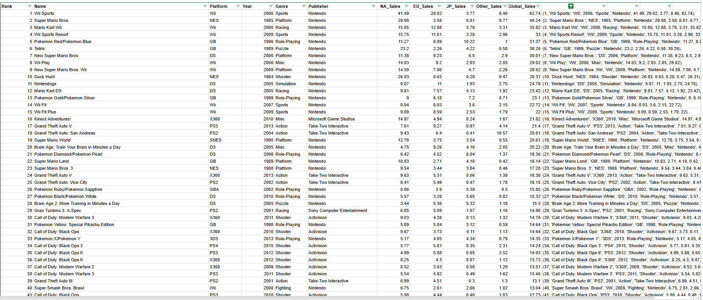
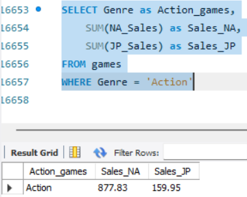
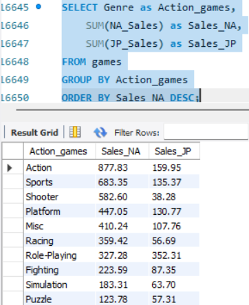
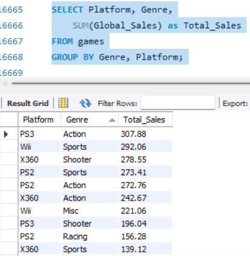
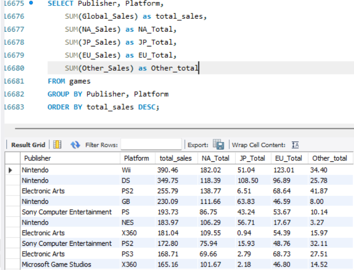
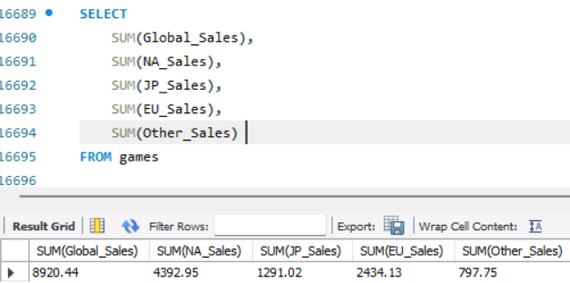
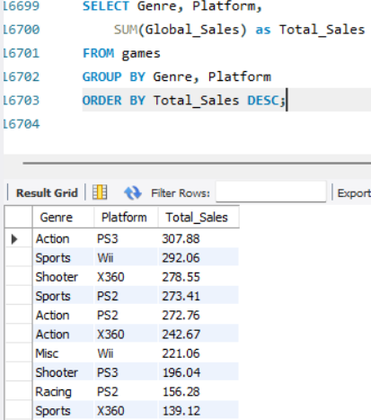
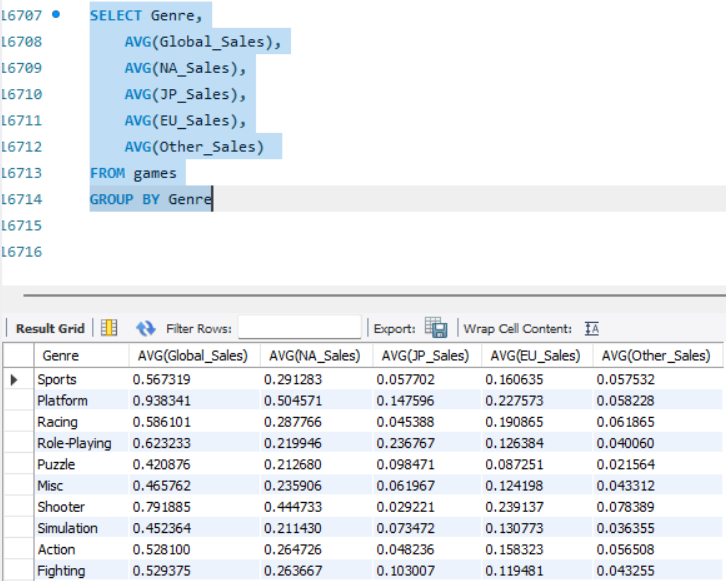
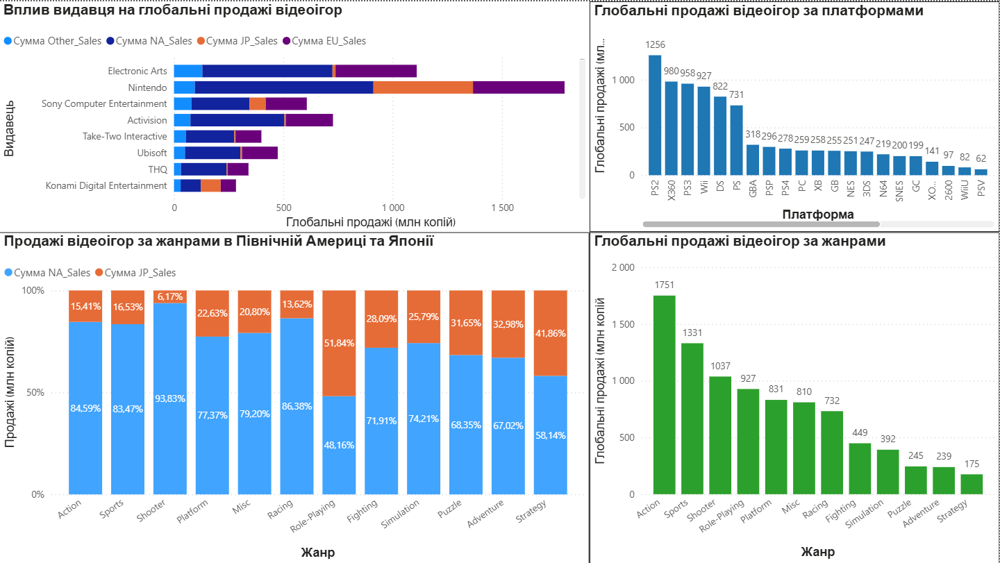

# Video_Game_Sales_Analisis
# Аналіз продажів відеоігор за регіонами, жанрами, платформами та видавцями
📌 Продуктова проблема

Маркетинговий відділ великої ігрової компанії стикається з проблемою нерівномірної ефективності продажів відеоігор у різних регіонах світу.

Незважаючи на проведення активних маркетингових кампаній, деякі ігри не досягають очікуваних результатів, тоді як інші демонструють високий попит лише на окремих ринках.

Компанія не має чіткого розуміння, які саме фактори впливають на успішність відеоігор:

регіональні переваги користувачів;
жанр гри;
вибір ігрової платформи;
видавець гри.

Ця проблема має не лише фінансовий характер, а й стратегічне значення, оскільки неправильне визначення цільової аудиторії та ринкових особливостей може призвести до неефективного використання маркетингового бюджету.

Для вирішення проблеми було проведено аналіз продажів відеоігор, визначено ключові фактори впливу на продажі та сформовано рекомендації щодо покращення маркетингових стратегій.

🎯 Мета проєкту

Метою цього проєкту є аналіз продажів відеоігор у різних регіонах та визначення закономірностей, які впливають на комерційний успіх ігор.

Основні завдання:

провести очищення та підготовку даних;
виконати описовий аналіз продажів;
дослідити залежність продажів від жанру, платформи та видавця;
перевірити три бізнес-гіпотези;
створити аналітичний дашборд у Power BI;
сформувати рекомендації для маркетингового відділу.
🛠 Використані інструменти
Google Sheets — очищення та підготовка даних.
MySQL — аналіз даних, створення SQL-запитів та перевірка гіпотез.
Power BI — створення інтерактивного дашборду та візуалізація результатів.

## 🧹 Очищення даних (Google Sheets)

Підготовка даних для MySQL

Після очищення датасет було підготовлено для імпорту у SQL.

Було виконано:

заміну пустих значень на NULL;
обробку спеціальних символів;
створення SQL INSERT-формату
зміни всіх стовпчиків у правильні формати

та ось посилання на таблицю: https://docs.google.com/spreadsheets/d/1kNep7Pn2nSL-TDDpIzU0pMQPR0Ru9Z3xZ2VRk6WsHv8/edit?usp=sharing

## 🗄 SQL Аналіз

Після імпорту очищених даних у MySQL було проведено аналітичне дослідження продажів.

### Перевірка гіпотез

#### Гіпотеза 1
"Ігри жанру Action продаються краще у Північній Америці, але слабше в Японії"

Для перевірки було проведено порівняння продажів жанру Action у різних регіонах.

Результати показали:

Action має значно більші продажі у Північній Америці;
у Японії цей жанр менш популярний.

Для повнішої картини було також порівняно продажі всіх жанрів у Північній Америці та Японії.

Результат:

винятком є жанр Role-Playing, який має сильніші позиції на японському ринку.

Висновок:

✅ Гіпотеза підтверджена.

Регіональні особливості мають значний вплив на популярність жанрів.

#### Гіпотеза 2
"Продажі відеоігор більше залежать від платформи, ніж від жанру"

Було проведено аналіз продажів за платформами.

Найбільші показники продемонстрували:

PlayStation 2;
Xbox 360;
PlayStation 3;
Nintendo Wii.

Висновок:

✅ Гіпотеза підтверджена.

Платформа має значний вплив на потенційний комерційний успіх гри.

#### Гіпотеза 3
"Ігри великих видавців мають стабільно вищі продажі у всіх регіонах"

Було проведено аналіз продажів за видавцями.

великі видавці мають високі сумарні продажі, але сильно нерівномірні по регіонах (напр. EA слабкий у Японії)

### Додатковий аналіз

Продажі за регіонами

Було розраховано загальні продажі:

North America;
Europe;
Japan;
Other;
Global Sales;

Аналіз жанрів та платформ

Створено зведені таблиці для порівняння:

жанрів;
платформ;
рівня продажів.

Середні значення продажів для кожного жанру в різних регіонах

## 📊 Power BI дашборд

На основі результатів SQL-аналізу створено інтерактивний дашборд у Power BI.

## ✅ Висновки та рекомендації

За результатами проведеного аналізу всі висунуті гіпотези були підтверджені.
На основі побудованих візуалізацій можна зробити висновок, що продажі відеоігор значною мірою залежать від жанру, платформи, регіону продажів та видавця.

Рекомендується адаптувати маркетингові стратегії відповідно до особливостей кожного регіону.
Зокрема, у Японії доцільно зосередити рекламні кампанії на жанрах, які мають найбільший попит серед місцевої аудиторії,
оскільки такі жанри, як Shooter, Sports та Action, демонструють нижчі показники продажів у цьому регіоні та можуть мати недостатню ефективність рекламних інвестицій.

У Північній Америці також варто враховувати регіональні переваги гравців та спрямовувати маркетингові ресурси на найбільш перспективні жанри,
які забезпечують вищий рівень продажів.

Також рекомендується приділяти більше уваги просуванню нових ігрових консолей від провідних виробників, оскільки платформа є одним із ключових факторів,
що впливає на обсяг продажів ігор. Видавцям варто планувати випуск нових ігор насамперед для найбільш популярних платформ,
щоб збільшити потенційну аудиторію та мінімізувати ризики втрати прибутку.

Додатково доцільно використовувати дані про успішність великих видавців для формування стратегічних партнерств та вибору найбільш перспективних напрямів розвитку.
При плануванні майбутніх релізів важливо враховувати не лише загальні продажі, а й ефективність маркетингових витрат,
регіональні особливості попиту та актуальні тенденції ігрового ринку.
